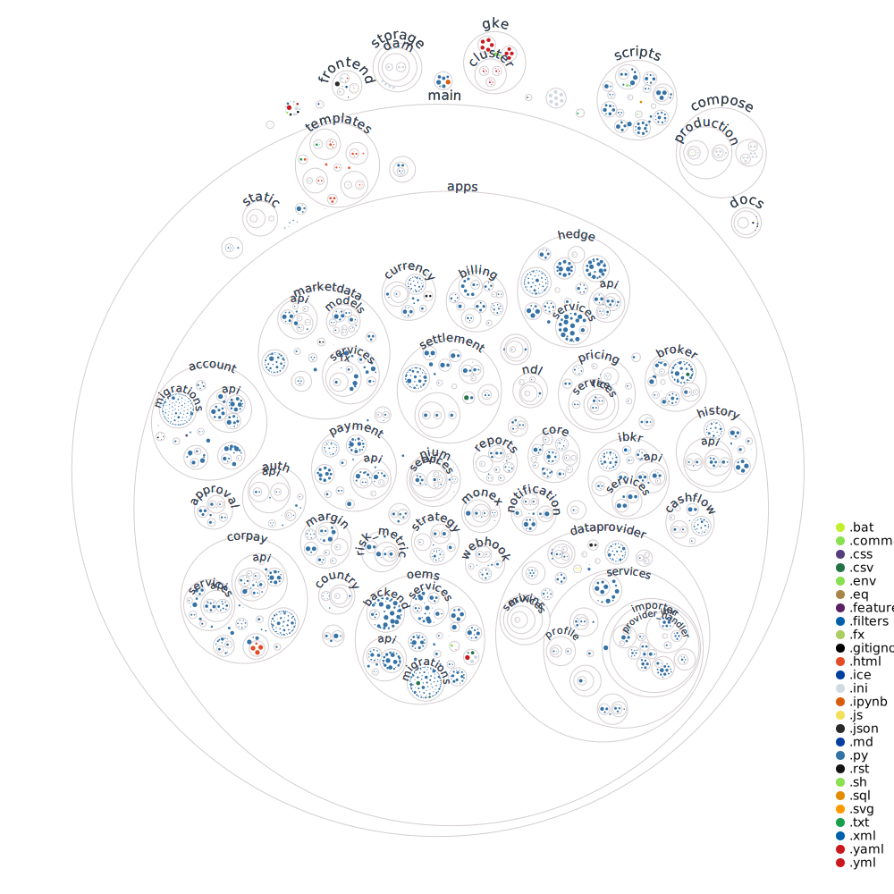

# How to setup dev-environment?

-   How to setup backend?
-   How to setup Frontend?

## How to setup backend?

### Setting up the connection to Google Cloud

1. [Install Google Cloud CLI](https://cloud.google.com/sdk/docs/install)
2. [Authorize the Google Cloud CLI with a user account](https://cloud.google.com/sdk/docs/authorizing#user-account)

    #### [Run gcloud init](https://cloud.google.com/sdk/docs/authorizing#init)

    ```bash
    gcloud init
    ```

    or

    #### [Run gcloud auth login](https://cloud.google.com/sdk/docs/authorizing#init)

    ```bash
    gcloud auth login
    ```

3. [Setup application default credential](https://cloud.google.com/sdk/docs/authorizing#adc)
    ```bash
    gcloud auth application-default login
    ```

### Create a virtual environment

#### Using venv

```bash
python3 -m venv venv
source venv/bin/activate
```

#### Using conda

```bash
conda create --name hd_dash python=3.10
```

### Install the requirements

```bash
pip install -r requirements/local.txt
```

### Setup environmental variables

```bash
cp .env.sample .env
```

Note: Please update the values for environmental variables.

### Run database and other services

```bash
docker-compose up -d
docker-compose ps
```

### Connect to Cloud SQL Auth Proxy

[About the Cloud SQL Auth proxy ](https://cloud.google.com/sql/docs/mysql/sql-proxy)

```bash
wget https://dl.google.com/cloudsql/cloud_sql_proxy.linux.amd64 -O cloud_sql_proxy
chmod +x cloud_sql_proxy
# ./cloud_sql_proxy -instances=<INSTANCE_HERE>=tcp:5432
./cloud_sql_proxy -instances=arq-ml-2021:us-east1:dev-thd-ml-psql-db=tcp:5432
```

**Expected output:**

```bash
CONTAINER ID   IMAGE                 COMMAND                  CREATED         STATUS         PORTS                                                                                                         NAMES
a7d1e2e5a998   redis:latest          "docker-entrypoint.s…"   7 minutes ago   Up 6 minutes   0.0.0.0:6379->6379/tcp                                                                                        hedgedesk_dashboard_redis_1
f10d93449ad9   postgres:latest       "docker-entrypoint.s…"   7 minutes ago   Up 6 minutes   0.0.0.0:5432->5432/tcp                                                                                        hedgedesk_dashboard_postgres_1
c57fd6464e7f   rabbitmq:management   "docker-entrypoint.s…"   7 minutes ago   Up 6 minutes   4369/tcp, 0.0.0.0:5671-5672->5671-5672/tcp, 15671/tcp, 15691-15692/tcp, 25672/tcp, 0.0.0.0:15672->15672/tcp   hedgedesk_dashboard_rabbitmq_1

```

### Collect static and create database tables

```bash
python manage.py collectstatic --no-input
python manage.py migrate
```

### Create superuser to access admin dashboard

```bash
python manage.py createsuperuser
```

### Dump Fixtures

```bash
python manage.py dumpdata currency.currency > main/apps/currency/fixtures/currencies.json
python manage.py dumpdata currency.fxpair > main/apps/currency/fixtures/fxpairs.json
python manage.py dumpdata marketdata.ircurve > main/apps/marketdata/fixtures/ircurves.json
python manage.py dumpdata marketdata.cmasset > main/apps/marketdata/fixtures/cmassets.json
python manage.py dumpdata dataprovider.dataprovider dataprovider.source dataprovider.profile dataprovider.mapping dataprovider.value > main/apps/dataprovider/fixtures/dataprovider.json
```

### Install fixtures

```bash
python manage.py loaddata main/apps/currency/fixtures/currencies.json
python manage.py loaddata main/apps/currency/fixtures/fxpairs.json
python manage.py loaddata main/apps/marketdata/fixtures/cmassets.json
python manage.py loaddata main/apps/marketdata/fixtures/ircurves.json
python manage.py loaddata main/apps/marketdata/fixtures/issuers.json
python manage.py loaddata main/apps/marketdata/fixtures/fxestimators.json
python manage.py loaddata main/apps/dataprovider/fixtures/dataprovider.json
```

### Install Feature EAV attributes

```bash
python manage.py createfeatureattributes
```

### Run Django development server

```bash
python manage.py runserver
```

Dashboard should be available at http://127.0.0.1:8000/admin/

## How to setup frontend?

### Running server

Build React Static Content and Copy files to Django

```bash
./build.sh
```

Run Server

```bash
./manage.py runserver
```

### Squashing migration files

```bash
# note: replace [env-name] with the virtual environment's name e.g. venv
find . -path "*/migrations/*.py" -not -name "__init__.py" -not -path "*/[env-name]/*" -delete
find . -path "*/migrations/*.pyc" -not -path "*/[env-name]/*" -delete
./manage.py makemigrations
```

### Recreate local db after a migration squash

```bash
sudo -iu postgres
dropdb DB_NAME
createdb DB_NAME
exit
./manage.py migrate
```

## How to setup frontend?

### Install NVM

[Node Version Manager](https://github.com/nvm-sh/nvm#node-version-manager---)

```bash
curl -o- https://raw.githubusercontent.com/nvm-sh/nvm/v0.39.1/install.sh | bash
nvm install v16.14.0 || nvm install --lts
nvm use
npm i -g yarn@1.22.17
```

### Running server

Build React Static Content and Copy files to Django

```bash
./build.sh
```

### Versions

```
node -v
v16.14.0

yarn -v
1.22.17

npm -v
8.3.1
```

### Debug Celery task functions using pycharm

```
# celery worker
$env:PYCHARM_DEBUG="True"; $env:PYDEVD_PYCHARM_PORT="6900"; $env:DJANGO_SETTINGS_MODULE="main.settings.local"; celery -A main worker --loglevel=debug -n dev --concurrency=1 --pool=solo -Q celery_pangea_local_queue

# celery beat
celery -A main beat -l debug

# python debug server
# IDE host name = localhost
# Port = 6900
# pip install pydevd-pycharm
```

### Project Visualization


